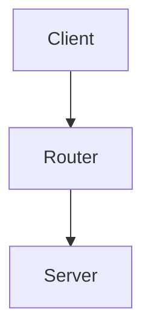
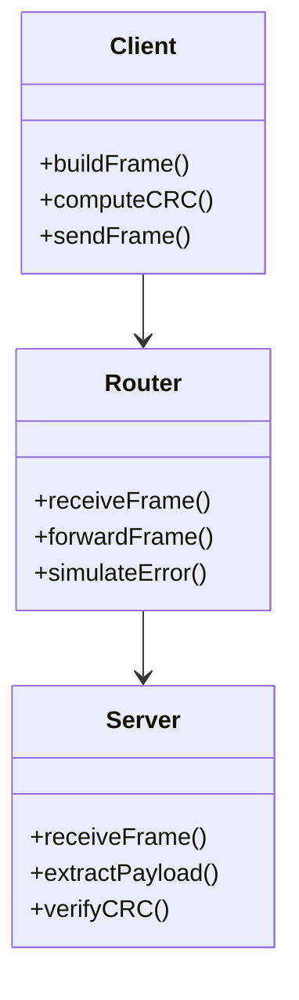
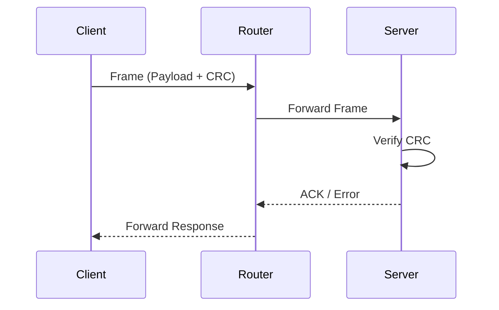

# CRC Network Simulation in C


---

# 📌 Project Overview

This project implements a **network communication simulation** in C using TCP sockets.  
It models a simplified Data Link Layer transmission process with **CRC-4 error detection**.

The system consists of three independent programs:

- **Client**
- **Router**
- **Server**

The Router forwards frames between Client and Server and can simulate transmission errors.

---

# 🏗 System Architecture

## 🔷 High-Level Architecture



---

## 🔷 UML Component Diagram



---

# 🔄 Sequence Diagram



---

# 📦 Frame Structure

Each transmitted frame follows this structure:

```
FLAG | SRC | DST | PAYLOAD | CRC | FLAG
```

## Field Description

| Field | Description |
|--------|-------------|
| FLAG | Frame delimiter (00000000) |
| SRC | Source address |
| DST | Destination address |
| PAYLOAD | Binary message |
| CRC | 4-bit CRC generated using polynomial 10011 |

---

# 🔢 CRC Algorithm Details

- **Polynomial Used:** `10011`
- **CRC Type:** CRC-4
- **Method:** Modulo-2 binary division
- **Purpose:** Detect transmission errors

### CRC Workflow

1. Append 4 zero bits to payload
2. Perform modulo-2 division
3. Append remainder to frame
4. Receiver recomputes CRC
5. If remainder = 0000 → Frame valid

---

# 🌐 OSI Layer Mapping

This project simulates multiple OSI layers:

| Layer | Implementation |
|-------|----------------|
| Application | User input & output |
| Transport | TCP Sockets |
| Data Link | Frame structure + CRC |
| Physical (Simulated) | Bit transmission |

---

# 🛠 Technologies Used

- C Programming Language
- TCP Socket Programming
- Winsock2 (Windows API)
- select() system call
- CRC Error Detection Algorithm
- Modular system design

---

# 🚀 Build Instructions

## 🔹 Using Makefile (Recommended)

```bash
make
```

## 🔹 Manual Compilation (Windows - MinGW)

```bash
gcc client.c -o client -lws2_32
gcc router.c -o router -lws2_32
gcc server.c -o server -lws2_32
```

---

# ▶ Execution Steps

Open **three terminals**:

### Terminal 1
```
server.exe
```

### Terminal 2
```
router.exe
```

### Terminal 3
```
client.exe
```

---

# 🧪 Error Simulation

To simulate bit corruption, uncomment the following line in `router.c`:

```c
// if (strlen(buff) > 30)
//     buff[30] = (buff[30]=='0')?'1':'0';
```

This flips one bit in the frame and allows CRC verification testing.

---

# 📊 System Workflow Summary

1. Client builds frame
2. CRC is computed
3. Frame sent to Router
4. Router forwards frame (optionally corrupts)
5. Server verifies CRC
6. Server sends acknowledgment

---

# 🎯 Learning Objectives

This project demonstrates:

- Error detection using CRC
- TCP communication in C
- Frame construction
- Network simulation
- Modular architecture design
- UML system modeling
- OSI layer abstraction

---

# 📈 Possible Improvements

- Bitwise CRC optimization
- Cross-platform Linux version
- Packet loss simulation
- Logging system
- Performance benchmarking
- Dynamic frame parsing
- Multi-client support

---

# 👨‍💻 Author

Your Name  
Computer Networks Project  
